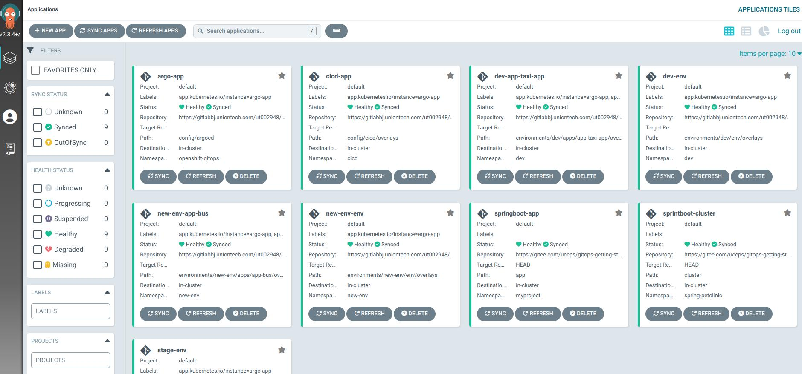

# 第二天

## 现有项目中添加

### 添加环境

```shell
$ kam environment add \
  --env-name new-env \
  --pipelines-folder gitops-kam-journal/
 ✓  Created Environment new-env successfully.
```

### 添加新应用

```shell
$ kam service add \
  --env-name new-env \
  --app-name app-bus \
  --service-name bus \
  --git-repo-url https://gitlabbj.uniontech.com/ut002948/bus \
  --pipelines-folder gitops-kam-journal
```

为应用添加部署配置

* `100-deployment.yaml`

```shell
$ cat > gitops-kam-journal/environments/new-env/apps/app-bus/services/bus/base/100-deployment.yaml << EOF
apiVersion: apps/v1
kind: Deployment
metadata:
  creationTimestamp: null
  name: bus
  namespace: new-env
spec:
  replicas: 1
  selector:
    matchLabels:
      app.kubernetes.io/name: bus
      app.kubernetes.io/part-of: app-bus
  strategy: {}
  template:
    metadata:
      creationTimestamp: null
      labels:
        app.kubernetes.io/name: bus
        app.kubernetes.io/part-of: app-bus
    spec:
      containers:
      - image: nginxinc/nginx-unprivileged:latest
        imagePullPolicy: Always
        name: bus
        ports:
        - containerPort: 8080
        resources: {}
      serviceAccountName: default
status: {}
EOF
```

* `200-service.yaml`

```shell
cat > gitops-kam-journal/environments/new-env/apps/app-bus/services/bus/base/200-service.yaml <<EOF
apiVersion: v1
kind: Service
metadata:
  creationTimestamp: null
  labels:
    app.kubernetes.io/name: bus
    app.kubernetes.io/part-of: app-bus
  name: bus
  namespace: dev
spec:
  ports:
  - name: http
    port: 8080
    protocol: TCP
    targetPort: 8080
  selector:
    app.kubernetes.io/name: bus
    app.kubernetes.io/part-of: app-bus
status:
  loadBalancer: {}
EOF
```

* `kustomization.yaml`

```shell
cat > gitops-kam-journal/environments/new-env/apps/app-bus/services/bus/base/kustomization.yaml <<EOF
resources:
- 100-deployment.yaml
- 200-service.yaml
EOF
```


### 更新仓库

```shell
$ git add .
$ git commit -m "Add new service"
$ git push origin main
```

上传代码后将自动更新环境并同步argo

## 检查

+ 开发者目录环境


+ gitops


